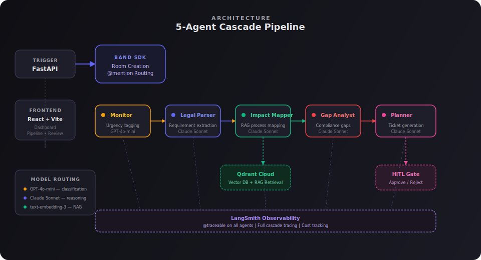
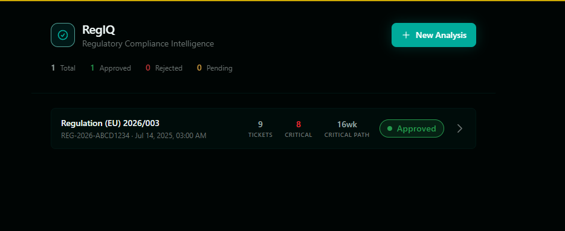
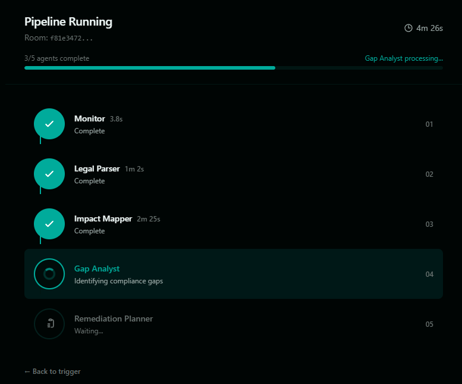
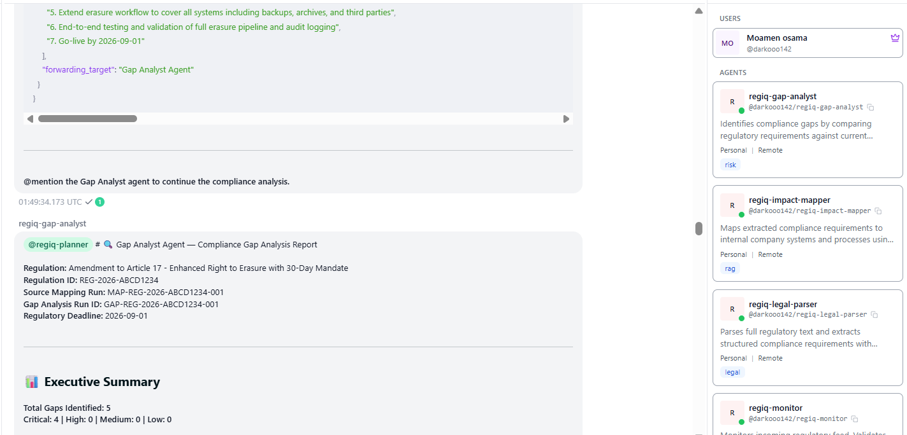
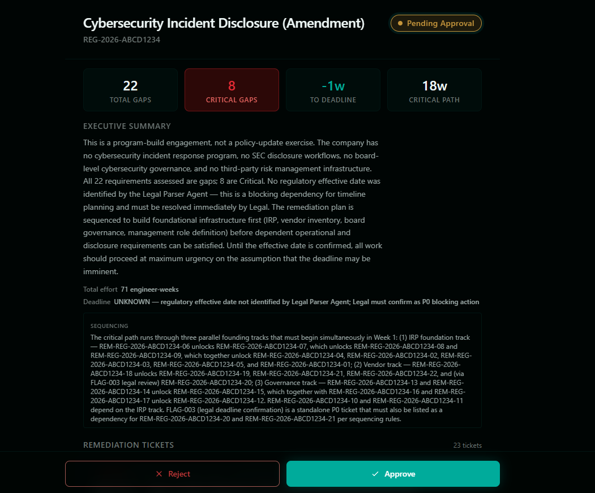
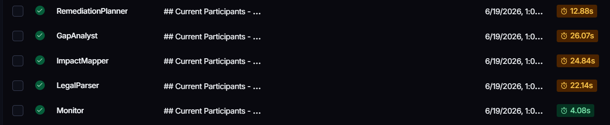

# RegIQ — Regulatory Compliance Intelligence

> **Band of Agents Hackathon** · lablab.ai · June 2026
> Built by [Moamen Osama (Darko)](#)

When a new regulation drops, compliance teams spend weeks reading legal text, extracting obligations, mapping them to company processes, and writing remediation plans. **RegIQ replaces all of that with a 5-agent AI cascade that completes in under 90 seconds.**

```
Monitor → Legal Parser → Impact Mapper → Gap Analyst → Remediation Planner
```

Each agent is an autonomous process connected via Band SDK. They communicate through @mentions in a shared Band chat room, cascading output from one to the next in real time.

---

## How Band Orchestrates the Cascade

Band is the live orchestration layer that makes RegIQ's multi-agent pipeline possible. Without Band, each agent would be an isolated LLM call. With Band, they become a **self-organizing cascade** that unfolds in real time in a shared chat room.

**The mechanism:**

1. **Room creation** — FastAPI creates a Band chat room and adds all 5 agents as participants via the Band REST API.

2. **@mention routing** — When the Monitor finishes processing, it @mentions the Legal Parser in its message. Band delivers that message directly to the Legal Parser's `on_message` handler. No message queues, no pub/sub brokers, no shared state. Just @mentions.

3. **Chain reaction** — Each agent resolves the next agent in the cascade by calling `get_participants()` and matching the target slug. The Legal Parser @mentions the Impact Mapper. The Impact Mapper @mentions the Gap Analyst. The Gap Analyst @mentions the Remediation Planner. The cascade unfolds automatically.

4. **Live visibility** — Every agent message, every @mention, every timing metric appears in the Band chat room in real time. Judges can watch the cascade happen — it's not a pre-computed output or a hidden pipeline.

5. **Human-in-the-loop** — The human user is also a participant in the Band room. The Remediation Planner @mentions them when the final report is ready. The human can review and respond directly in the chat.

```
FastAPI creates room
  → Adds 5 agents + human as participants
    → Sends regulation to @monitor
      → Monitor → @legal-parser
        → Legal Parser → @impact-mapper
          → Impact Mapper → @gap-analyst
            → Gap Analyst → @planner
              → Planner → @human (HITL gate)
```

**Why Band instead of alternatives?**
- **vs. function calls:** Function calls are synchronous and tightly coupled. Band agents are independent processes that can run on different machines.
- **vs. message queues (Redis/RabbitMQ):** Message queues require infrastructure, configuration, and monitoring. Band is a managed platform — register agents, add them to a room, and they communicate.
- **vs. shared memory:** Shared memory creates race conditions and state management nightmares. Band agents are stateless — they receive a message, process it, and @mention the next agent.
- **vs. HTTP webhooks:** Webhooks require each agent to know the next agent's URL. Band agents discover each other dynamically via `get_participants()`.

---

## Architecture



| Layer | What it does |
|-------|-------------|
| **FastAPI** | Receives regulation trigger, creates Band room, adds all 5 agents |
| **Band SDK** | WebSocket-based agent communication via @mention routing |
| **5 Agents** | Each agent is a standalone Python process with its own LLM call |
| **Qdrant Cloud** | Vector store for company knowledge base (SOPs, policies) |
| **LangSmith** | Full cascade tracing with `@traceable` on every agent |
| **React Frontend** | Dashboard, pipeline visualization, HITL review page |

---

## Demo

### 1. Dashboard — Analysis History



The home page shows all past compliance analyses with status badges, ticket counts, critical gap counts, and critical path estimates. Click any row to review the full report.

### 2. Trigger — Select a Regulation

Choose from preloaded mock regulations (GDPR Amendment, APAC Cross-Border, SEC Cybersecurity) or paste custom regulation text. The cascade starts with one click.

### 3. Pipeline — Real-Time Agent Progress



Watch 5 AI agents process your regulation in real time. Each agent lights up as it begins work, showing elapsed time and status. The full cascade completes in ~90 seconds.

### 4. Band Chat — Live Agent Cascade



The Band chat room shows the full cascade in action. Each agent posts its output and @mentions the next agent in the chain. Judges can see the system working live — it's not a pre-computed demo.

### 5. Review — Approve or Reject



The final remediation report shows an executive summary, prioritized tickets with dependency chains, and total effort estimates. Approve or reject with one click — the decision is recorded and the report is finalized.

### 6. LangSmith — Full Observability



Every agent call is traced end-to-end in LangSmith. See LLM inputs/outputs, timing, token usage, and the full cascade flow across all 5 agents.

---

## How It Works

**Step 1 — Trigger**
A regulation is submitted via the FastAPI endpoint or the React frontend. The backend creates a Band chat room, adds all 5 cascade agents as participants, and sends the regulation text to the Monitor agent via @mention.

**Step 2 — Cascade**
The Monitor agent parses the regulation, assigns urgency, and @mentions the Legal Parser. The Legal Parser extracts structured requirements and @mentions the Impact Mapper. The Impact Mapper queries the Qdrant vector store for relevant company SOPs, maps requirements to internal processes, and @mentions the Gap Analyst. The Gap Analyst identifies compliance gaps with severity ratings and @mentions the Remediation Planner.

**Step 3 — Remediation**
The Remediation Planner generates a prioritized ticket list with dependency chains, effort estimates, and a critical path. It POSTs the report to the FastAPI backend and posts the final output to the Band chat room.

**Step 4 — Human Review**
A human reviews the remediation plan on the React review page. They approve or reject the plan with one click. The decision is recorded and the report status is updated.

---

## Tech Stack

| Layer | Technology | Why |
|-------|-----------|-----|
| Agent Communication | [Band SDK](https://app.band.ai) | @mention-based cascade routing, real-time WebSocket |
| Agent Framework | LangGraph + LangChain | Stateful agent graphs, structured output, tool calling |
| LLMs | AI/ML API (OpenAI-compatible) | Single API key for 3 model families |
| Backend | FastAPI + Python 3.11 | Async, auto-docs, in-memory state for demo |
| Frontend | React 19 + Vite + TypeScript + Tailwind CSS v4 | Fast dev, type safety, utility-first styling |
| Vector Store | Qdrant Cloud | Managed vector DB, no Docker needed |
| Observability | LangSmith | Full cascade tracing, cost tracking |
| Data Validation | Pydantic v2 | Typed schemas shared between agents and API |

---

## Model Routing

RegIQ routes inference across 3 model families through a single AI/ML API key. Each model is chosen for its strength:

| Agent | Model | Cost | Why This Model |
|-------|-------|------|----------------|
| **Monitor** | GPT-4o-mini | Cheap | Just parses JSON and tags urgency. Fast classification task. |
| **Legal Parser** | Claude Sonnet | Balanced | Dense legal text needs strong instruction following and reasoning. |
| **Impact Mapper** | Claude Sonnet | Balanced | RAG provides context. Model synthesizes and formats the mapping. |
| **Gap Analyst** | Claude Sonnet | Balanced | Most critical agent. Compliance gap identification requires careful judgment. |
| **Remediation Planner** | Claude Sonnet | Balanced | Structured ticket generation with dependency chains. |
| **Embeddings** | text-embedding-3-small | Cheap | Standard OpenAI embeddings for RAG retrieval. |

**Cost per full compliance analysis: ~$0.05.** The equivalent from a compliance consulting firm: $5,000–$15,000.

---

## Agents

### Monitor
- **Input:** Raw regulation text (JSON or plain text)
- **Output:** Structured assessment with urgency level, key requirements, and summary
- **Model:** GPT-4o-mini
- **Special:** Uses `with_structured_output(method="json_mode")` for reliable JSON extraction

### Legal Parser
- **Input:** Monitor assessment + original regulation text
- **Output:** Requirement-by-requirement parse with source articles, deadlines, severity, and affected entities
- **Model:** Claude Sonnet
- **Special:** Extracts implicit obligations (audit systems, recordkeeping) as separate line items

### Impact Mapper
- **Input:** Legal Parser output + company knowledge base (via RAG)
- **Output:** Requirements mapped to internal systems, processes, and team owners
- **Model:** Claude Sonnet + Qdrant RAG
- **Special:** Queries Qdrant for relevant company SOPs, policies, and process docs

### Gap Analyst
- **Input:** Impact mapping data
- **Output:** Compliance gaps with severity (P0/P1/P2), affected requirements, and effort estimates
- **Model:** Claude Sonnet
- **Special:** Cross-references mapped requirements against current company state

### Remediation Planner
- **Input:** Gap analysis data
- **Output:** Prioritized remediation tickets with dependency chains, effort, and critical path
- **Model:** Claude Sonnet
- **Special:** Terminal agent — POSTs final report to FastAPI, no downstream cascade

---

## Quick Start

### Prerequisites
- Python 3.11+
- Node.js 18+
- [uv](https://docs.astral.sh/uv/) (Python package manager)
- Band account with 5 registered agents ([app.band.ai](https://app.band.ai))

### 1. Clone and install

```bash
git clone <repo-url> RegIQ
cd RegIQ

# Python dependencies
uv sync

# Frontend dependencies
cd frontend && npm install && cd ..
```

### 2. Configure environment

```bash
cp .env.example .env
```

Edit `.env` with your keys:
- `AIML_API_KEY` — [AI/ML API](https://aimlapi.com) key
- `QDRANT_API_KEY` + `QDRANT_CLUSTER_ENDPOINT` — [Qdrant Cloud](https://cloud.qdrant.io)
- `LANGSMITH_API_KEY` — [LangSmith](https://smith.langchain.com) key (optional, for tracing)

Copy your Band agent credentials:
```bash
cp configs/agent_config.yaml.example configs/agent_config.yaml
```

Edit `configs/agent_config.yaml` with your 5 agent IDs and API keys from Band.

### 3. Seed the knowledge base

```bash
uv run python scripts/seed_kb.py
```

This embeds the mock company SOPs into Qdrant. Run once.

### 4. Start the backend

```bash
uv run uvicorn main:app --port 8000 --reload
```

### 5. Start the frontend

```bash
cd frontend && npm run dev
```

Open [http://localhost:5173](http://localhost:5173).

### 6. Start the agents (5 separate terminals)

```bash
uv run python agents/monitor/agent.py
uv run python agents/legal_parser/agent.py
uv run python agents/impact_mapper/agent.py
uv run python agents/gap_analyst/agent.py
uv run python agents/remediation_planner/agent.py
```

### 7. Trigger a cascade

Either:
- **Frontend:** Go to [http://localhost:5173/trigger](http://localhost:5173/trigger), select a regulation, click "Start Compliance Analysis"
- **API:** `curl -X POST http://localhost:8000/api/v1/trigger -H "Content-Type: application/json" -d '{"regulation_id": "GDPR-2026-003"}'`

---

## API Reference

| Method | Endpoint | Description |
|--------|----------|-------------|
| `GET` | `/api/v1/health` | Health check |
| `GET` | `/api/v1/info` | System info |
| `POST` | `/api/v1/trigger` | Trigger cascade (sends regulation to Monitor) |
| `GET` | `/api/v1/trigger/regulations` | List available mock regulations |
| `POST` | `/api/v1/hitl/report/{id}` | Store a generated report |
| `GET` | `/api/v1/hitl/report/{id}` | Get a specific report |
| `GET` | `/api/v1/hitl/latest` | Get the most recent report |
| `GET` | `/api/v1/hitl/reports` | List all reports with status |
| `POST` | `/api/v1/hitl/respond` | Approve or reject a report |
| `GET` | `/api/v1/hitl/status/{id}` | Check HITL decision status |

---

## Project Structure

```
RegIQ/
├── main.py                          # FastAPI entry point
├── pyproject.toml                   # Dependencies + build config
├── .env.example                     # Environment variable template
│
├── agents/
│   ├── monitor/                     # Agent 1: urgency tagging (GPT-4o-mini)
│   ├── legal_parser/                # Agent 2: requirement extraction (Claude Sonnet)
│   ├── impact_mapper/               # Agent 3: RAG process mapping (Claude Sonnet)
│   ├── gap_analyst/                 # Agent 4: compliance gap analysis (Claude Sonnet)
│   └── remediation_planner/         # Agent 5: ticket generation (Claude Sonnet)
│
├── api/routes/
│   ├── health.py                    # GET /health, GET /info
│   ├── regulations.py               # POST /trigger, GET /trigger/regulations
│   └── hitl.py                      # HITL endpoints (report, decision, status)
│
├── core/
│   ├── settings.py                  # Pydantic Settings (SSOT for env vars)
│   ├── llm.py                       # LLM + embeddings factory (AI/ML API)
│   ├── band_config.py               # Band credential loading
│   ├── band_client.py               # Band room creation + message sending
│   ├── cascade.py                   # @mention-based cascade target resolution
│   └── timing.py                    # Pipeline timing + heartbeat tracking
│
├── models/
│   ├── regulation.py                # RegulationInput, RegulationAssessment
│   ├── requirement.py               # ComplianceRequirement, ParsedRequirements
│   ├── impact.py                    # ImpactMapping, ImpactAssessment
│   ├── gap.py                       # ComplianceGap, GapAnalysis
│   └── report.py                    # RemediationTicket, ComplianceReport
│
├── rag/
│   ├── indexer.py                   # Embed + upsert company docs into Qdrant
│   └── retriever.py                 # Query Qdrant for relevant company context
│
├── data/
│   ├── mock_regulations/            # Demo regulation payloads
│   └── company_kb/                  # Mock company SOPs and policies
│
├── frontend/
│   ├── src/
│   │   ├── pages/
│   │   │   ├── DashboardPage.tsx    # Report history + stats
│   │   │   ├── TriggerPage.tsx      # Regulation picker + custom text
│   │   │   ├── PipelinePage.tsx     # Real-time agent progress
│   │   │   └── ReviewPage.tsx       # Report review + HITL decision
│   │   ├── components/              # StatusBadge, ActionBar, HITLReview, etc.
│   │   ├── api.ts                   # API client functions
│   │   └── types.ts                 # TypeScript interfaces
│   └── package.json
│
├── scripts/
│   ├── seed_kb.py                   # Load company docs into Qdrant
│   ├── test_llm.py                  # AI/ML API connectivity test
│   └── test_band_config.py          # Band credential test
│
└── configs/
    └── agent_config.yaml            # Band agent IDs + API keys
```

---

## What Makes This Different

**Band-powered multi-agent cascade, not a wrapper.** RegIQ runs 5 independent agent processes orchestrated entirely through Band SDK. Each agent is a standalone Python process with its own LLM call, its own prompt, and its own reasoning. They communicate exclusively through Band's @mention routing system — no shared memory, no function calls, no message queues. The entire cascade unfolds live in a Band chat room, visible to judges in real time.

**Intentional model routing.** Classification goes to the cheapest model. Legal reasoning goes to the best model. Embeddings go to the standard model. This isn't arbitrary — it's a cost-optimized architecture that keeps analysis under $0.05 per regulation.

**Why reasoning models matter here.** We tested GPT-4o-mini on the Legal Parser and Gap Analyst agents — it failed. Lightweight models can't reliably extract nuanced legal obligations from dense regulatory text, identify compliance gaps against company SOPs, or produce structured severity assessments. Legal compliance is a reasoning-heavy domain: one misread clause means a missed obligation. Claude Sonnet handles this because it reasons through multi-step legal analysis rather than pattern-matching. The Monitor uses GPT-4o-mini because it only needs to parse JSON and tag urgency — no deep reasoning. This routing is the difference between a working system and one that hallucinates compliance gaps.

**RAG-grounded compliance.** The Impact Mapper doesn't guess — it queries your actual company SOPs from Qdrant and maps requirements to real processes. When the gap analyst finds a 90-day vs 30-day conflict, it's grounded in your actual data retention policy.

**Human-in-the-loop gate.** The Remediation Planner doesn't auto-apply fixes. It generates a prioritized plan with dependency chains and presents it for human approval. The HITL gate ensures compliance decisions stay with humans.

**Full observability.** Every LLM call, every agent transition, every timing metric is traced in LangSmith via `@traceable`. You can replay the entire cascade, debug failures, and track costs.

---

## Built with AI/ML API

> **Intentional model routing through a single API key.** RegIQ uses AI/ML API as the unified inference layer across 3 model families — choosing the right model for each task instead of defaulting to one expensive model for everything.

| Task | Model via AI/ML API | Cost Tier | Why |
|------|---------------------|-----------|-----|
| Regulation classification & urgency tagging | `gpt-4o-mini` | Cheap | Fast JSON parsing and categorization — no deep reasoning needed |
| Legal requirement extraction | `anthropic/claude-sonnet-4.6` | Balanced | Dense legal text demands strong instruction following and careful reasoning |
| RAG-based process mapping | `anthropic/claude-sonnet-4.6` | Balanced | Synthesizes retrieved company SOPs with regulatory requirements |
| Compliance gap identification | `anthropic/claude-sonnet-4.6` | Balanced | Most critical judgment call — needs accurate severity assessment |
| Remediation ticket generation | `anthropic/claude-sonnet-4.6` | Balanced | Structured output with dependency chains and effort estimates |
| Document embeddings (RAG) | `text-embedding-3-small` | Cheap | Standard OpenAI embeddings for semantic retrieval from Qdrant |

**The math:** A single GPT-4o call for all 5 agents would cost ~$0.30 per analysis and waste frontier-model tokens on simple classification. RegIQ's routed approach costs **~$0.05 per analysis** — 6x cheaper — while using frontier reasoning only where it matters.

**One API key, three model families.** AI/ML API handles Google (embeddings), Anthropic (reasoning), and OpenAI (classification) through a single `AIML_API_KEY`. No separate accounts, no separate billing, no separate SDKs. LangChain's `ChatOpenAI` client routes everything through the AI/ML API base URL.

---

## License

MIT
